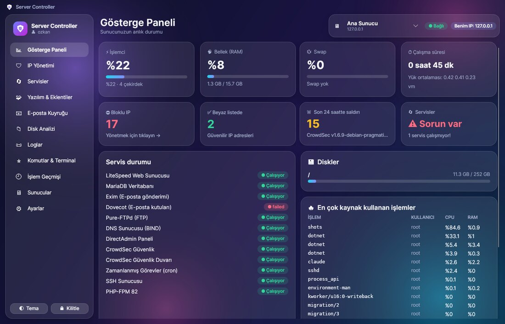
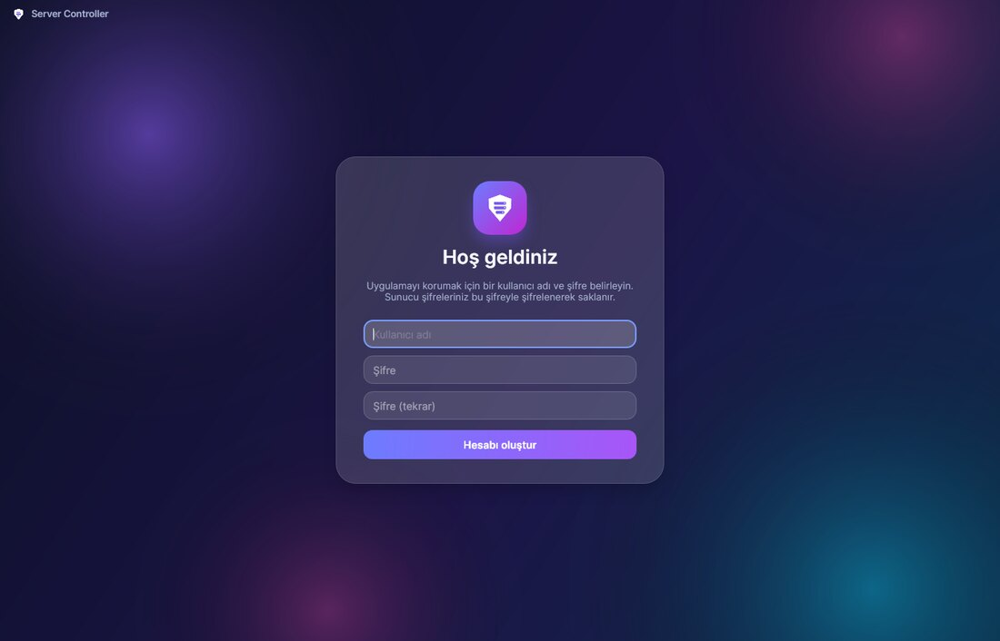
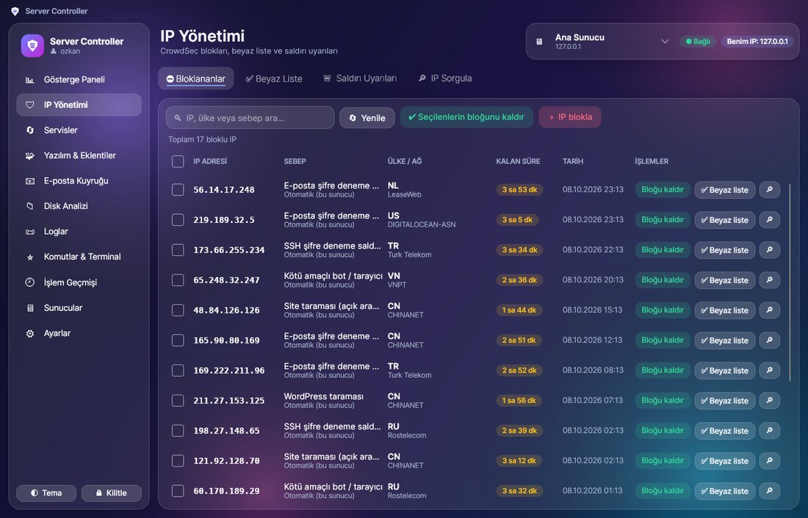
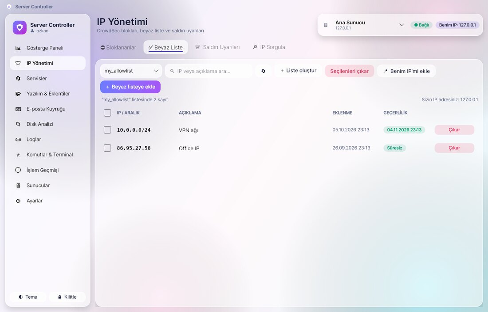

# Server Controller

DirectAdmin + CrowdSec kullanan VPS sunucularını **konsol komutu yazmadan** yönetmek için Windows masaüstü uygulaması.
PuTTY'de elle yazdığınız komutları arka planda sizin yerinize çalıştırır; siz sadece butonlara tıklarsınız.



## Özellikler

| Bölüm | Neler yapılabilir |
|---|---|
| 🔐 **Giriş** | Uygulamanın kendi kullanıcı adı / şifresi (SQLite'ta yalnızca **hash** olarak saklanır). Hareketsiz kalınca otomatik kilitlenir. |
| 📊 **Gösterge Paneli** | İşlemci, RAM, swap, disk doluluğu, çalışma süresi, servis durumu, en çok kaynak kullanan işlemler, bloklu IP / beyaz liste / son 24 saat saldırı sayıları. |
| 🛡️ **IP Yönetimi (CrowdSec)** | Bloklu IP'leri sebep, ülke, kalan süre ile listeleme · tek tek veya toplu blok kaldırma · elle IP / IP aralığı bloklama · beyaz liste (allowlist) görüntüleme, ekleme, çıkarma · "Benim IP'mi ekle" · saldırı uyarıları · **IP sorgulama** ("bu IP neden giremiyor?"). |
| 🔄 **Servisler** | LiteSpeed, MariaDB/MySQL, Exim, Dovecot, FTP, DNS, DirectAdmin, CrowdSec, PHP-FPM… yeniden başlat / başlat / durdur / durum · LiteSpeed önbelleğini temizle · sunucuyu yeniden başlat (çift onaylı). |
| 🧩 **Yazılım & Eklentiler** | PHP sürümü ekle / değiştir / kaldır · PHP eklentileri (ionCube, Imagick, Redis, intl…) · CustomBuild güncellemeleri, DirectAdmin güncelleme, phpMyAdmin, Roundcube, Softaculous · DirectAdmin eklentilerini aç/kapat · **WordPress**: siteleri otomatik bulur, eklenti kur/ara/güncelle/aç-kapat/sil, WordPress çekirdeğini güncelle, önbellek temizle. |
| 📧 **E-posta Kuyruğu** | Bekleyen mailleri görme, en çok gönderenler (spam tespiti), seçilenleri / bir gönderenin tümünü / donmuşları / tüm kuyruğu silme, kuyruğu yeniden gönderme. |
| 📁 **Disk Analizi** | Kullanıcı başına disk kullanımı, tıklayarak gezilebilen klasör boyutları, büyük dosyaları bulma ve silme. |
| 📜 **Loglar** | LiteSpeed, Exim, CrowdSec, SSH, DirectAdmin, MariaDB loglarını okuma, arama, "sadece hatalar" filtresi, **canlı izleme**. |
| ⭐ **Komutlar & Terminal** | Teknisyenin verdiği komutları isim vererek kaydedip tek tıkla çalıştırma · ileri seviye kullanıcılar için basit terminal. |
| 🕘 **İşlem Geçmişi** | Uygulamadan yapılan her işlem kaydedilir; aranabilir, Excel'e (CSV) aktarılabilir. |
| 🖥️ **Çoklu sunucu** | İstediğiniz kadar sunucu ekleyin, üst menüden aralarında geçiş yapın. |
| 🎨 **Görünüm** | macOS/iOS tarzı glassmorphism (buzlu cam) tasarım, koyu ve açık tema. |

### Güvenlik önlemleri

- **Kendini kilitleme koruması:** Uygulama, sunucunun gördüğü sizin IP adresinizi tespit eder ve bu IP'yi (veya onu kapsayan bir aralığı) bloklamanıza izin vermez.
- **SQLite veritabanı:** Veriler uygulama klasöründeki `data\servercontroller.db` dosyasında durur.
  - Uygulama şifresi yalnızca **hash** (PBKDF2-SHA256, 310.000 tur, tuzlu) olarak saklanır.
  - Sunucu (root) şifreleri SSH bağlantısı için geri okunabilmesi gerektiğinden hash'lenemez. Bunun yerine **AES-256-GCM** ile şifrelenir; anahtar yalnızca doğru uygulama şifresiyle açılır.
- **Sunucu kimlik doğrulaması:** İlk bağlantıda sunucunun parmak izi gösterilip onayınız alınır ve kaydedilir; sonradan değişirse uyarılırsınız.
- **Komut enjeksiyonuna karşı koruma:** Kullanıcının yazdığı her değer (IP, açıklama, eklenti adı…) doğrulanır ve kabuk için güvenli şekilde tırnaklanır.
- Silme, durdurma, yeniden başlatma gibi tehlikeli işlemler her zaman onay ister.

## Kurulum (kullanıcı için)

1. GitHub'da **Releases** bölümünden `ServerController-win-x64.zip` dosyasını indirin (veya **Actions → en son çalışma → Artifacts**).
2. Zip'i istediğiniz bir yere (ör. Belgeler veya USB bellek) çıkarın ve klasördeki `ServerController.exe` dosyasına çift tıklayın. Bu **portable** bir sürümdür: kurulum gerekmez, .NET yüklü olması gerekmez. Yedek almak için klasördeki `data` klasörünü kopyalamanız yeterlidir.
   - Windows "Bilinmeyen yayıncı" uyarısı verirse **Ek bilgi → Yine de çalıştır** deyin (uygulama dijital olarak imzalı değildir).
3. İlk açılışta uygulama için bir **kullanıcı adı ve şifre** belirleyin.
4. **Sunucular → Sunucu ekle** ile PuTTY'de kullandığınız bilgileri girin:
   - Sunucu adresi (IP), SSH portu, kullanıcı adı (`root`), root şifresi
   - CrowdSec beyaz liste adı (teknisyeninizin komutundaki ad, örn. `my_allowlist`)
5. İlk bağlantıda çıkan "Yeni sunucu kimliği" penceresini onaylayın. Hepsi bu!

## Sunucu gereksinimleri

- Linux (AlmaLinux / Rocky / CentOS / Debian / Ubuntu), SSH erişimi (root)
- **CrowdSec 1.6.8 veya üstü** (beyaz liste / `cscli allowlists` için)
- DirectAdmin + CustomBuild 2.0 (PHP/yazılım bölümü için)
- WordPress bölümü için WP-CLI (yoksa uygulama tek tıkla kurar)

## Ekran görüntüleri

| | |
|---|---|
|  |  |
|  |  |

## Geliştirici notları

- C# / .NET 8, [Avalonia UI](https://avaloniaui.net/) 11 (MVVM, CommunityToolkit.Mvvm), [SSH.NET](https://github.com/sshnet/SSH.NET), SQLite (Microsoft.Data.Sqlite)
- Proje yapısı:
  - `src/ServerController/Services`: SSH bağlantısı, SQLite veritabanı ve şifreleme, CrowdSec / sistem / CustomBuild / WordPress / mail / disk işlemleri
  - `src/ServerController/ViewModels`: ekran mantığı
  - `src/ServerController/Views` ve `Styles`: arayüz (XAML) ve glassmorphism teması
- Çalıştırma: `dotnet run --project src/ServerController`
- Windows için portable klasör:

  ```
  dotnet publish src/ServerController/ServerController.csproj -c Release -r win-x64 --self-contained true -p:PublishReadyToRun=true -o publish/ServerController
  ```

- GitHub Actions (`.github/workflows/build.yml`) her `main` gönderiminde uygulamayı derler. `v1.0.0` gibi bir etiket gönderildiğinde zip'i içeren otomatik bir **Release** oluşturur.
