<div align="center">

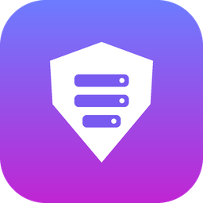

# Server Controller

**DirectAdmin + CrowdSec sunucunuzu konsol komutu ezberlemeden, birkaç tıkla yönetin.**

Bloklanan IP'leri görün, tek tıkla bloğu kaldırın, güvendiğiniz IP'leri beyaz listeye ekleyin,
servisleri yeniden başlatın, PHP ve WordPress eklentilerini kurun. PuTTY açmadan, komut yazmadan.

[-7C5CFF?style=for-the-badge)](https://github.com/ozkancesim/ServerController/releases/latest/download/ServerController-win-x64.zip)
&nbsp;
[](https://github.com/ozkancesim/ServerController/releases/latest)


</div>

---

## 💡 Neden bu uygulama?

Sunucusunda CrowdSec çalışan herkesin bildiği bir senaryo var: bir müşteri, bir çalışan ya da siz
birkaç kez yanlış şifre girersiniz, IP adresiniz bloklanır ve siteye ya da maile erişilemez.
Çözüm için PuTTY'yi açmak, root şifresini girmek, teknisyenin verdiği komutu bulup doğru yazmak gerekir.

**Server Controller bu işi butonlara dönüştürür.** Uygulama sunucunuza arka planda SSH ile bağlanır ve
komutları sizin yerinize çalıştırır. Siz yalnızca ne yapmak istediğinizi seçersiniz.

## ⬇️ İndirme ve kurulum

> **[ServerController-win-x64.zip dosyasını indirmek için tıklayın](https://github.com/ozkancesim/ServerController/releases/latest/download/ServerController-win-x64.zip)**
> (Windows 10 / 11, 64 bit, yaklaşık 60 MB)

1. Zip dosyasını indirin, sağ tıklayıp **Tümünü ayıkla** deyin. Belgeler, Masaüstü veya bir USB bellek, nereye isterseniz.
2. Açılan klasördeki **`ServerController.exe`** dosyasına çift tıklayın.
   - Bu bir **portable** sürümdür: kurulum yapmaz, .NET veya başka bir program yüklemenizi istemez.
   - İsterseniz exe'ye sağ tıklayıp *Gönder → Masaüstü (kısayol oluştur)* ile masaüstüne kısayol koyabilirsiniz.
   - Windows *"Windows kişisel bilgisayarınızı korudu"* uyarısı gösterirse **Ek bilgi → Yine de çalıştır** deyin.
     Uygulama dijital sertifikayla imzalanmadığı için bu uyarı normaldir. Kaynak kodun tamamı bu depoda açıktır.
3. İlk açılışta uygulama için kendinize bir **kullanıcı adı ve şifre** belirleyin. Bu şifre sunucu şifreniz değildir,
   yalnızca uygulamayı korur.
4. **Sunucular → ＋ Sunucu ekle** ile PuTTY'de kullandığınız bilgileri girin: sunucu IP'si, SSH portu,
   kullanıcı adı (`root`) ve şifre. CrowdSec beyaz liste adını da yazın (örn. `my_allowlist`).
5. İlk bağlantıda sunucunun kimliğini (parmak izini) onaylayın. Artık hazırsınız. 🎉

> 🔄 **Güncelleme:** Uygulama açılışta yeni sürüm olup olmadığına bakar. Varsa üst çubukta **"⬆ vX.Y.Z hazır"** düğmesi çıkar;
> tıklayınca yeni sürüm indirilir, doğrulanır (SHA-256) ve uygulama kendini güncelleyip yeniden açılır. Sunucularınız,
> ayarlarınız ve geçmişiniz (`data` klasörü) korunur. Elle denetlemek için **Ayarlar → Güncellemeler**.

---

## ✨ Özellikler

### 🛡️ IP yönetimi (CrowdSec)

Uygulamanın kalbi bu bölümdür. Bloklanan her IP için **neden bloklandığı** (Türkçe açıklamayla, örn.
"SSH şifre deneme saldırısı", "WordPress taraması"), **hangi ülkeden geldiği** ve **bloğun ne zaman biteceği** görünür.

- Tek tıkla ya da seçerek **toplu blok kaldırma**
- Elle **IP veya IP aralığı bloklama** (1 saatten kalıcıya kadar süre seçimi)
- **Beyaz liste** (allowlist): görüntüleme, açıklamayla ekleme, süreli ekleme, çıkarma
- **"Benim IP'mi ekle"**: şu anki IP adresinizi otomatik bulup beyaz listeye ekler
- **Saldırı uyarıları**: CrowdSec'in yakaladığı son saldırılar
- **IP sorgula**: "Bu müşteri neden giremiyor?" sorusunun cevabı tek ekranda
- **🩺 Teşhis**: "Blokladım ama hâlâ girebiliyor" durumunda nedenini bulur. CrowdSec'i, blok uygulayıcıyı (bouncer), güvenlik duvarını, IPv6'yı ve Cloudflare'i kontrol eder; sitenize son bağlanan IP'leri gösterir

<p align="center">
  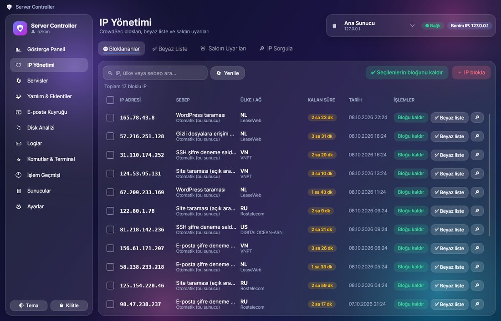
  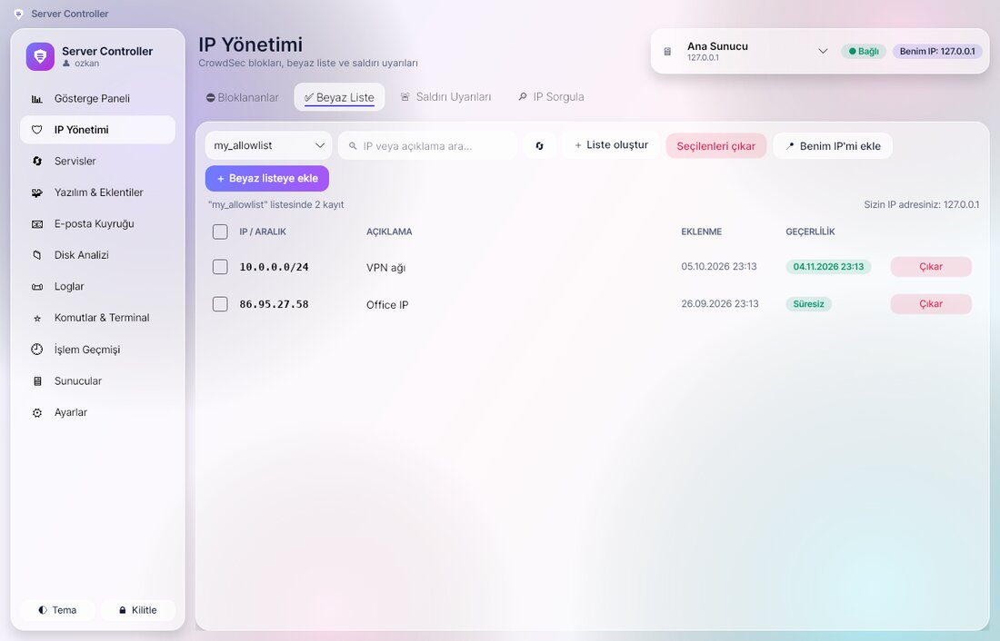
</p>
<p align="center">
  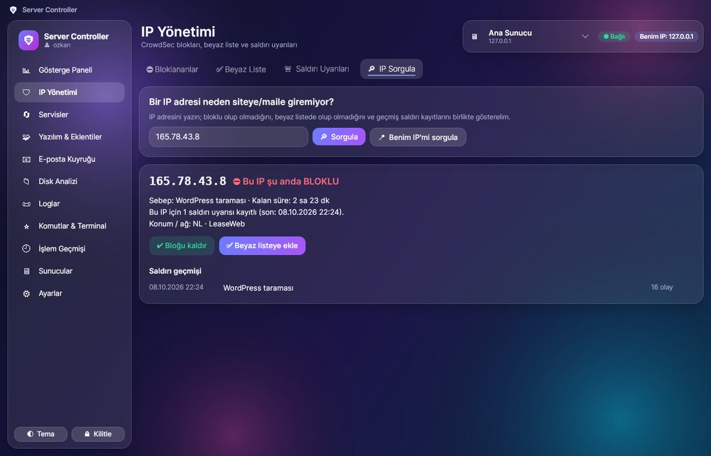
  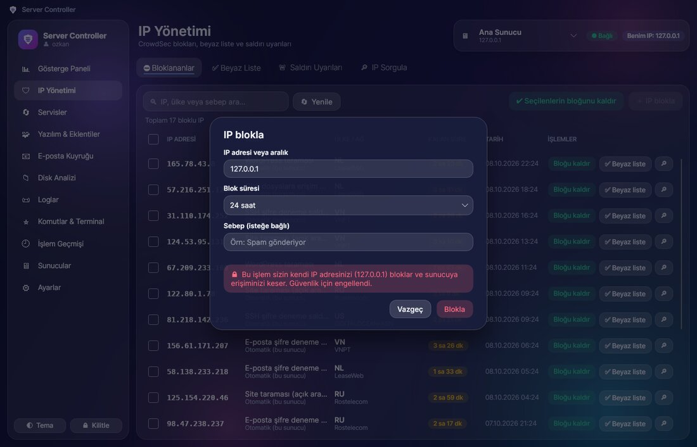
</p>

<p align="center">
  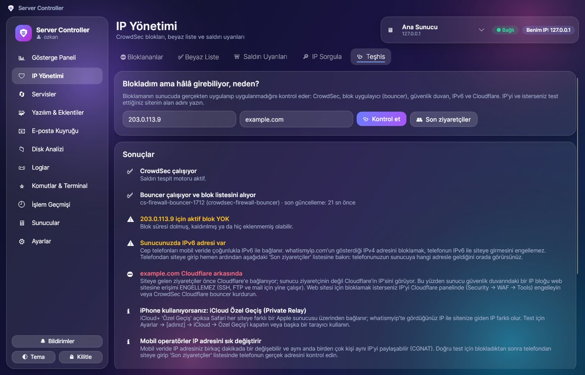
</p>

> 🔒 **Kendini kilitleme koruması:** Uygulama, sunucunun gördüğü sizin IP adresinizi bilir ve kendi IP'nizi
> (veya onu kapsayan bir aralığı) yanlışlıkla bloklamanıza izin vermez.

### 📊 Gösterge paneli ve 🔄 servisler

İşlemci, RAM, disk, çalışma süresi, en çok kaynak tüketen işlemler ve tüm servislerin durumu tek bakışta görünür.
LiteSpeed, MariaDB/MySQL, Exim, Dovecot, FTP, DNS, DirectAdmin, CrowdSec ve PHP-FPM servislerini
**yeniden başlatabilir, durdurabilir, başlatabilirsiniz**. LiteSpeed önbelleğini temizlemek ve sunucuyu
yeniden başlatmak da birer tık uzaklıkta. Yeniden başlatma çift onay ister.

<p align="center">
  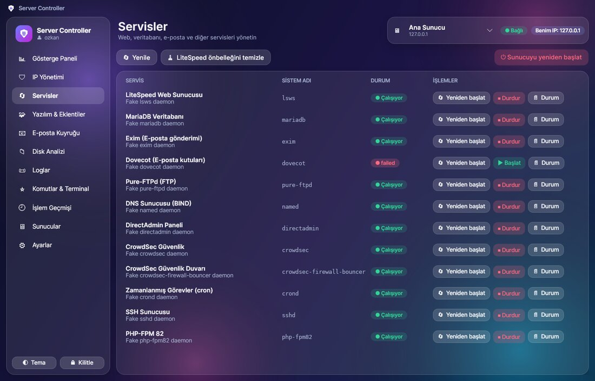
</p>

### 🧩 Yazılım ve eklentiler

- **PHP:** sürüm ekleme, değiştirme, kaldırma (CustomBuild ile)
- **PHP eklentileri:** ionCube, Imagick, Redis, intl, OPcache… tek tıkla kur veya kaldır
- **CustomBuild:** güncelleme kontrolü, tüm yazılımları güncelleme, DirectAdmin, LiteSpeed, phpMyAdmin, Roundcube, Softaculous
- **DirectAdmin eklentileri:** aç / kapat
- **WordPress:** sunucudaki tüm WordPress sitelerini otomatik bulur. Eklenti arama, kurma, güncelleme,
  açma/kapatma ve silme işlemleri yapılabilir; WordPress çekirdeği güncellenebilir, önbellek temizlenebilir
  (WP-CLI yoksa uygulama tek tıkla kurar)

<p align="center">
  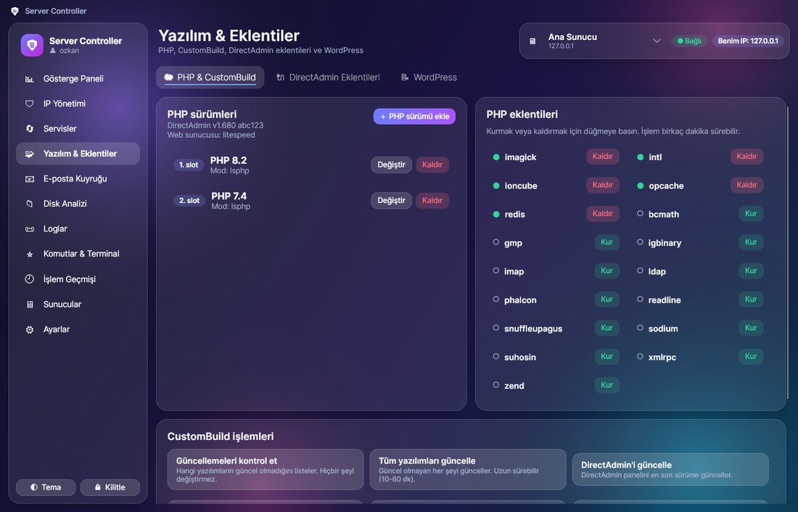
  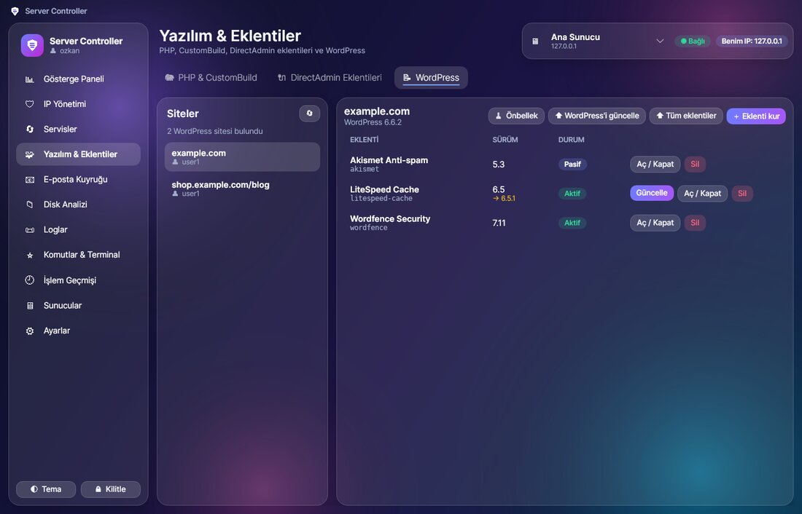
</p>

Uzun süren işlemler (PHP derleme gibi) canlı çıktı penceresinde izlenir, istenirse iptal edilebilir:

<p align="center">
  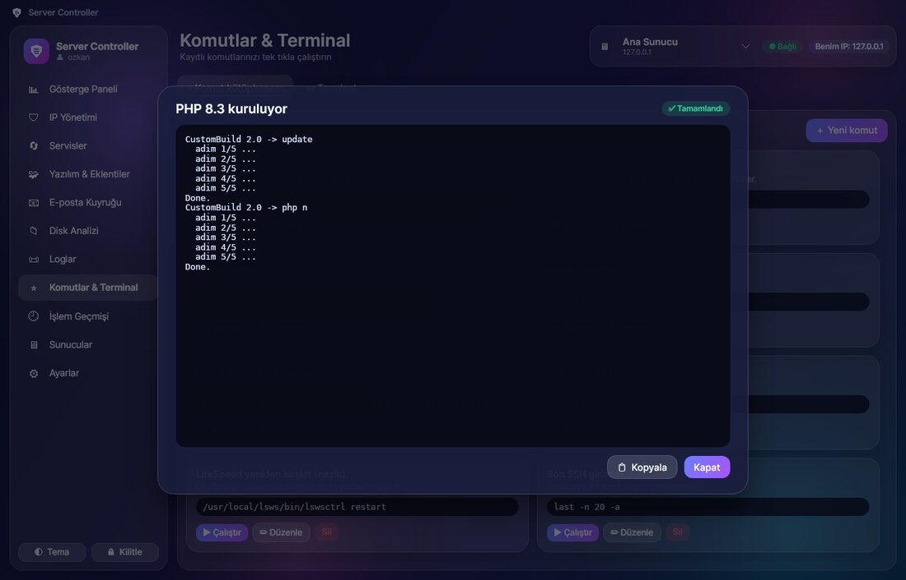
</p>

### 📧 E-posta, 📁 disk, 📜 loglar

- **E-posta kuyruğu:** bekleyen mailler ve **en çok gönderenler** listesi. Hacklenen bir site spam gönderiyorsa
  hemen fark edersiniz. Seçilenleri, bir gönderenin tümünü, donmuşları veya tüm kuyruğu silebilirsiniz.
- **Disk analizi:** kullanıcı başına disk kullanımı, tıklayarak gezilebilen klasör boyutları, büyük dosyaları bulup silme
- **Loglar:** LiteSpeed, Exim, CrowdSec, SSH, DirectAdmin, MariaDB logları. Arama, "sadece hatalar" filtresi ve **canlı izleme** var.

<p align="center">
  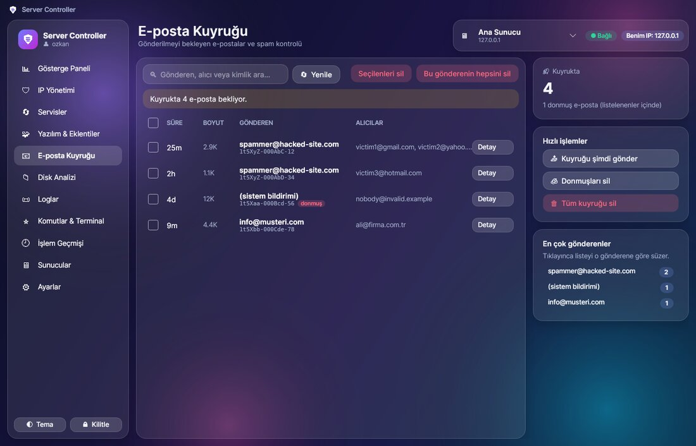
  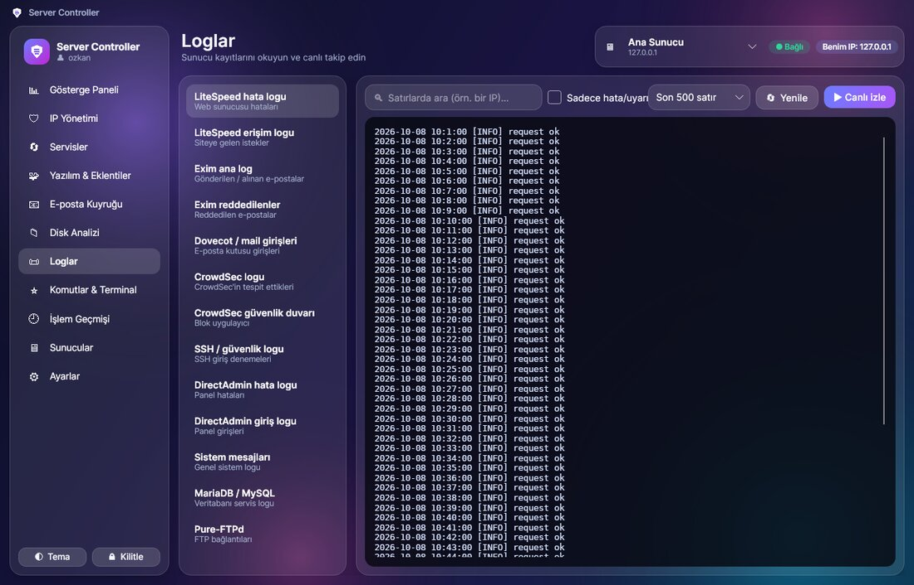
</p>

### ⭐ Ve dahası

- **Komut kütüphanesi:** teknisyeninizin verdiği komutları isim vererek kaydedin, tek tıkla çalıştırın
- **Terminal:** ileri seviye kullanıcılar için basit bir komut penceresi
- **İşlem geçmişi:** uygulamadan yapılan her işlem kaydedilir; aranabilir ve Excel'e (CSV) aktarılabilir
- **Birden fazla sunucu:** istediğiniz kadar sunucu ekleyin, üst menüden aralarında geçiş yapın
- **Koyu ve açık tema:** macOS / iOS tarzı buzlu cam (glassmorphism) tasarım
- **Otomatik kilit:** belirlediğiniz süre boyunca işlem yapılmazsa uygulama kendini kilitler
- **Tek tıkla güncelleme:** yeni sürüm çıkınca uygulama içinden indirip kurar

<p align="center">
  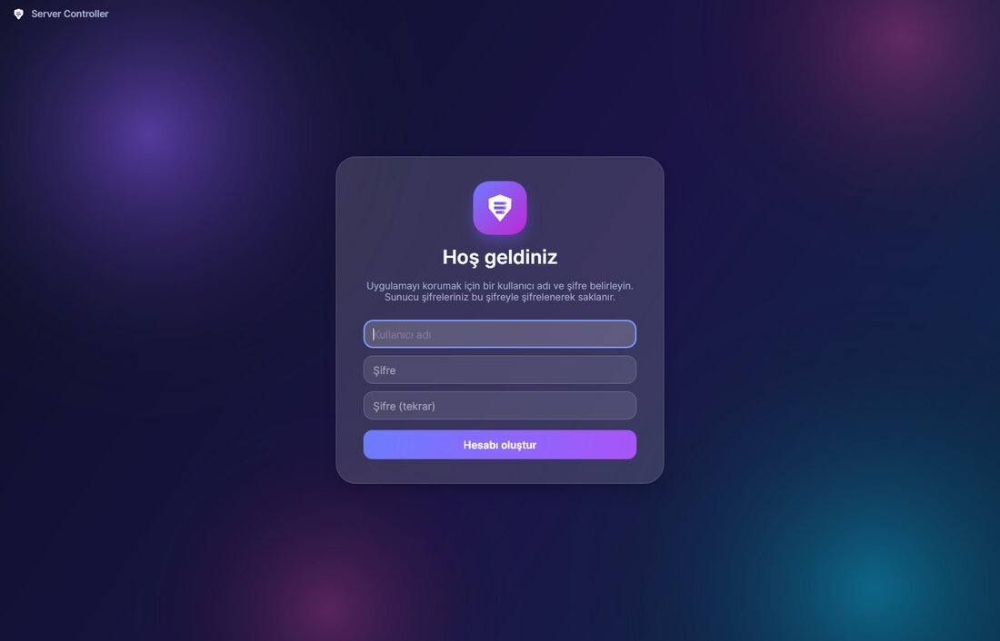
  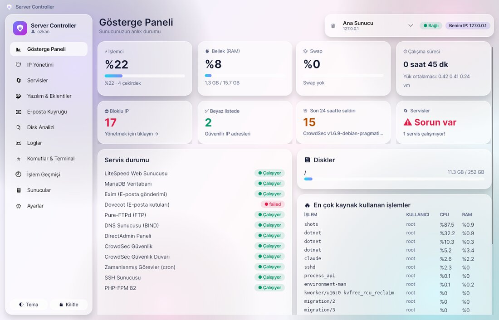
</p>

---

## 🔐 Güvenlik

| | |
|---|---|
| **Uygulama şifresi** | SQLite veritabanında yalnızca **hash** olarak saklanır (PBKDF2-SHA256, 310.000 tur, tuzlu). Geri çözülemez. |
| **Sunucu (root) şifreleri** | SSH ile bağlanırken gerektiği için hash'lenemez. Bunun yerine **AES-256-GCM** ile şifrelenir. Anahtar yalnızca doğru uygulama şifresiyle açılır. |
| **Veri konumu** | Her şey uygulama klasöründeki `data\servercontroller.db` dosyasında durur. Hiçbir veri internete veya üçüncü bir tarafa gönderilmez. Uygulama yalnızca sizin sunucunuza bağlanır. |
| **Sunucu kimliği** | İlk bağlantıda sunucunun parmak izi onayınıza sunulur. Sonradan değişirse uyarılırsınız. |
| **Güvenli komutlar** | Yazdığınız her değer (IP, açıklama, eklenti adı…) doğrulanır ve güvenli şekilde tırnaklanır. Komut enjeksiyonu yapılamaz. |
| **Onaylar** | Silme, durdurma, yeniden başlatma gibi tüm riskli işlemler onay ister. |

> ⚠️ Uygulama sunucuda **root** yetkisiyle komut çalıştırır. Bilgisayarınızı ve uygulama şifrenizi korumanız önemlidir.
> Kullanmadığınızda **🔒 Kilitle** düğmesini kullanın.

## 🖥️ Sunucu gereksinimleri

- Linux sunucu (AlmaLinux, Rocky, CentOS, Debian, Ubuntu) ve **root** ile SSH erişimi
- **CrowdSec 1.6.8 veya üstü** (beyaz liste / `cscli allowlists` desteği için)
- **DirectAdmin + CustomBuild 2.0** (PHP / yazılım bölümü için)
- WordPress bölümü için WP-CLI (yoksa uygulama kurar)

## ❓ Sık sorulan sorular

**Şifremi unuttum, ne yapmalıyım?**
Güvenlik gereği şifre kurtarılamaz. Giriş ekranındaki *Şifremi unuttum* ile uygulamayı sıfırlayabilirsiniz.
Kayıtlı sunucular silinir ve tekrar eklemeniz gerekir. Sunucunuzda hiçbir şey değişmez.

**Uygulama sunucuma bir şey kuruyor mu?**
Hayır. Yalnızca sizin seçtiğiniz işlemlerin komutlarını çalıştırır. Tek istisna, WordPress bölümünde onayınızla kurulan WP-CLI'dır.

**Verilerimi başka bilgisayara nasıl taşırım?**
Uygulama klasörünü (içindeki `data` klasörüyle birlikte) kopyalayın. Aynı kullanıcı adı ve şifreyle açılır.

**Bir IP'yi blokladım ama o IP'den siteye hâlâ girilebiliyor. Neden?**
**IP Yönetimi → 🩺 Teşhis** sekmesini açın, IP'yi ve sitenizin alan adını yazıp *Kontrol et* deyin. En sık nedenler:
- Site **Cloudflare** arkasındaysa sunucu ziyaretçinin gerçek IP'sini görmez. Bu durumda güvenlik duvarı bloğu web sitesine işlemez.
- Telefonlar mobil veride çoğunlukla **IPv6** kullanır. whatismyip'in gösterdiği IPv4 adresini bloklamak telefonun IPv6 bağlantısını engellemez.
- iPhone'da **iCloud Özel Geçiş (Private Relay)** açıksa siteye farklı bir IP ile gidilir.
- Blok uygulayıcı (**bouncer**) kurulu değilse veya durmuşsa bloklar uygulanmaz.

Teşhis ekranındaki **"Son ziyaretçiler"** listesi, telefonunuzun sunucuya hangi adresle geldiğini gösterir.

**Bir hata mesajı çıktı ama kayboldu, nasıl görebilirim?**
Hata mesajları siz kapatana kadar ekranda kalır ve **📋 Kopyala** düğmesi vardır. Geçmiş mesajlar sol menüdeki **🔔 Bildirimler**
düğmesinde durur. Teknik ayrıntılar uygulama klasöründeki `data\logs` içine yazılır.

**Bir hata buldum ya da öneri var.**
[Issues](https://github.com/ozkancesim/ServerController/issues) bölümünden bildirebilirsiniz.

---

## 🛠️ Geliştiriciler için

- **Teknolojiler:** C# / .NET 8, [Avalonia UI](https://avaloniaui.net/) 11 (MVVM, CommunityToolkit.Mvvm),
  [SSH.NET](https://github.com/sshnet/SSH.NET), SQLite (Microsoft.Data.Sqlite)
- **Klasörler:**
  - `src/ServerController/Services`: SSH, SQLite ve şifreleme, CrowdSec / sistem / CustomBuild / WordPress / mail / disk işlemleri
  - `src/ServerController/ViewModels`: ekran mantığı
  - `src/ServerController/Views`, `Styles`: arayüz (XAML) ve glassmorphism teması
- **Çalıştırma:** `dotnet run --project src/ServerController`
- **Portable paket:**

  ```
  dotnet publish src/ServerController/ServerController.csproj -c Release -r win-x64 --self-contained true -p:PublishReadyToRun=true -o publish/ServerController
  ```

- **Otomatik derleme:** `.github/workflows/build.yml` her `main` gönderiminde uygulamayı derler.
  `v1.2.3` biçiminde bir etiket gönderildiğinde zip dosyasıyla birlikte otomatik bir **Release** yayınlar.

## 📄 Lisans

[MIT](LICENSE) lisansı ile dağıtılır. Ücretsiz kullanabilir, değiştirebilir ve paylaşabilirsiniz.
